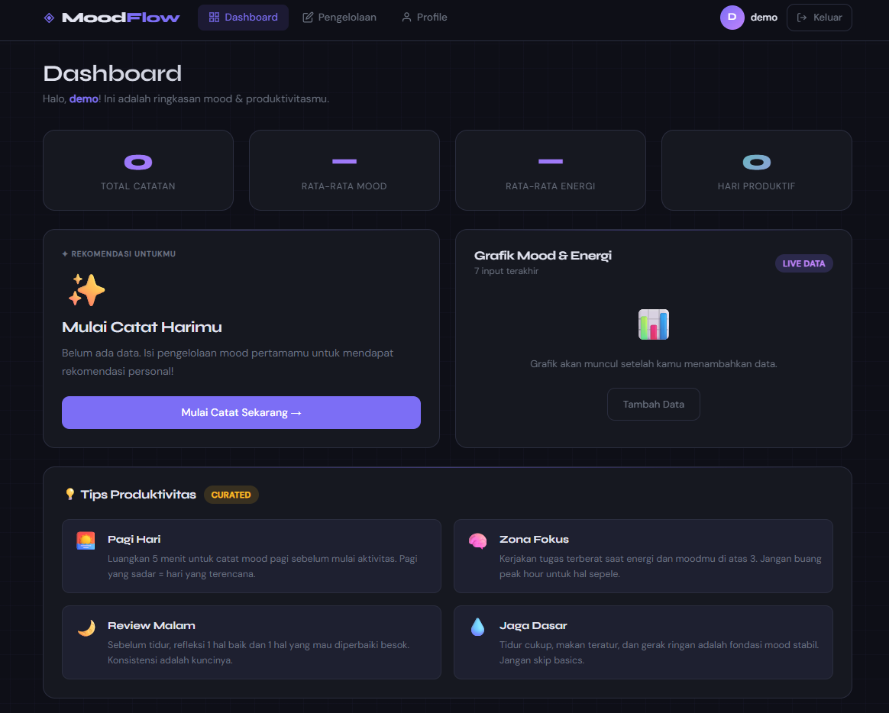
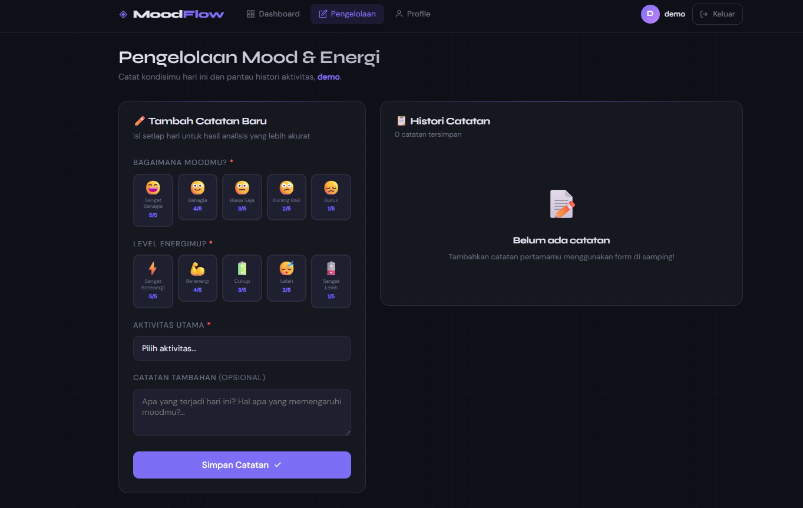

#  MoodFlow — Aplikasi Pengelolaan Mood & Energi Harian
 
> Proyek UTS Praktikum Pemrograman Web berbasis Laravel MVC
 
---
 
##  Deskripsi Wwebsite
 
**MoodFlow** adalah aplikasi web yang dirancang untuk membantu pengguna memahami dan mengelola kondisi mental serta energi mereka setiap hari. Aplikasi ini bukan sekadar to-do list biasa — MoodFlow fokus pada **kesadaran diri (self-awareness)** melalui pencatatan mood, level energi, dan aktivitas harian secara konsisten.
 
Dengan data yang terkumpul, sistem secara otomatis memberikan **rekomendasi kegiatan yang tepat** berdasarkan kondisi pengguna saat itu — apakah harus fokus belajar, istirahat, berolahraga, atau melakukan self-care. Grafik pola produktivitas juga ditampilkan agar pengguna bisa melihat tren kondisinya dari waktu ke waktu.
 
---
 
## 🖥️ Tampilan Aplikasi
 
### Dashboard

 
Halaman utama setelah login. Menampilkan ringkasan statistik (total catatan, rata-rata mood & energi, hari produktif), rekomendasi kegiatan yang dipersonalisasi, grafik line chart pola mood & energi 7 input terakhir, serta tips produktivitas harian.
 
---
 
### Pengelolaan Mood & Energi

 
Halaman inti untuk mencatat kondisi harian. Pengguna memilih level mood (1–5) dan energi (1–5) menggunakan antarmuka emoji interaktif, memilih aktivitas utama, dan menambahkan catatan opsional. Seluruh histori catatan ditampilkan secara real-time di sisi kanan dengan progress bar visual.
 
---
 
## Fitur Utama
 
- **Simulasi Login** : Autentikasi tanpa database menggunakan array, data username diteruskan ke seluruh halaman via session Laravel
- **Input Mood & Energi** : Skala 1–5 dengan antarmuka emoji yang intuitif
- **Rekomendasi Cerdas** : Sistem menganalisis data terakhir dan memberikan saran kegiatan yang relevan (belajar, olahraga, istirahat, self-care)
- **Grafik Produktivitas** : Line chart interaktif menggunakan Chart.js yang menampilkan tren mood & energi
- **Histori Catatan** : Semua catatan ditampilkan dengan `@foreach` dari controller, lengkap dengan progress bar visual
- **Halaman Profile** : Menampilkan info akun, statistik personal, dan 5 catatan terakhir
- **Responsif** : Layout menyesuaikan tampilan desktop maupun mobile
